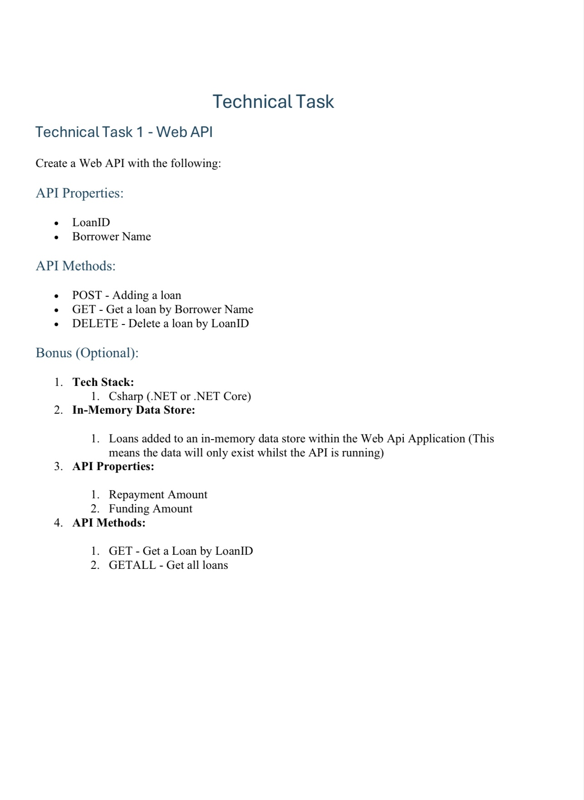
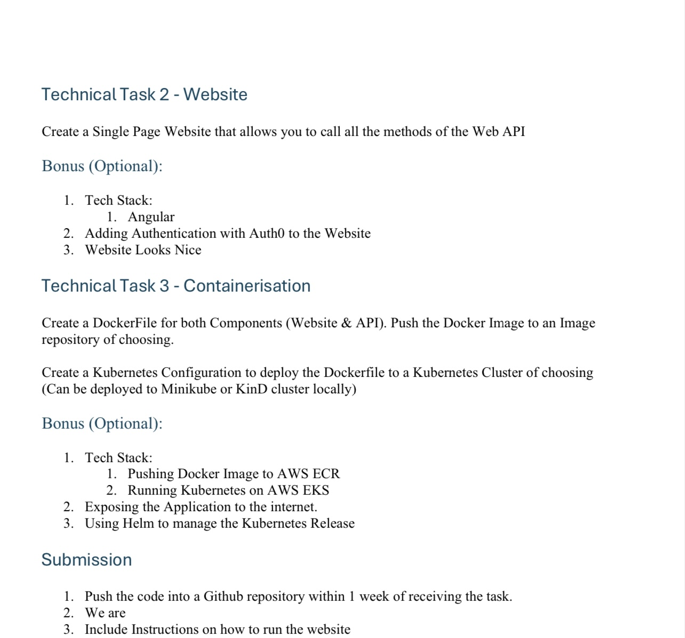

# Najib Tech

## The task:





## Local backend

```bash
dotnet run

# Add a loan
curl -X POST \
  -H "Content-Type: application/json" \
  -d '{"borrowerName": "Foo Bar", "repaymentAmount": 1000, "fundingAmount": 500}' \
  http://localhost:5000/api/loan

# Get all loans
curl http://localhost:5000/api/loan/all

# Get a load by Borrower Name
curl http://localhost:5000/api/loan?borrowerName=Foo%20Bar

# Get loan by ID
curl http://localhost:5000/api/loan/LOAN_ID

# Delete a loan
curl -X DELETE http://localhost:5000/api/loan/LOAN_ID
```

## Local frontend

```bash
cd loan-website
ng serve
```

## Container backend

```bash
docker build -t loan-api:latest .
docker run -d -p 5000:80 --name loan-api-container loan-api:latest
```

## Container frontend

```bash
docker build -t loan-website:latest .
docker run -d -p 8080:80 --name loan-website-container loan-website:latest
```
